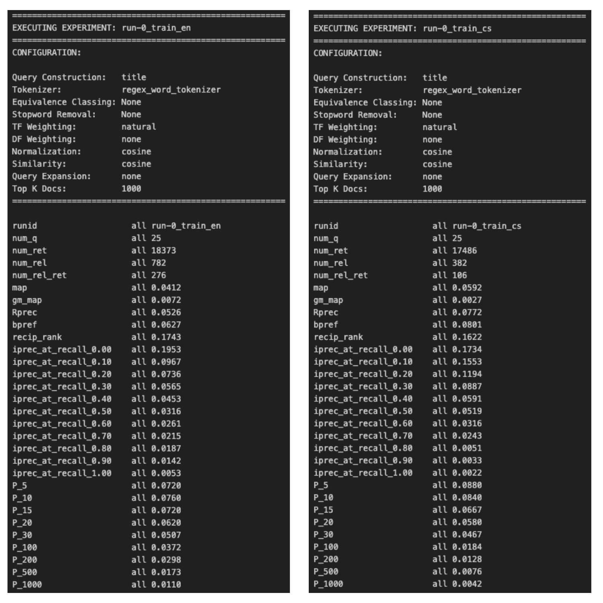
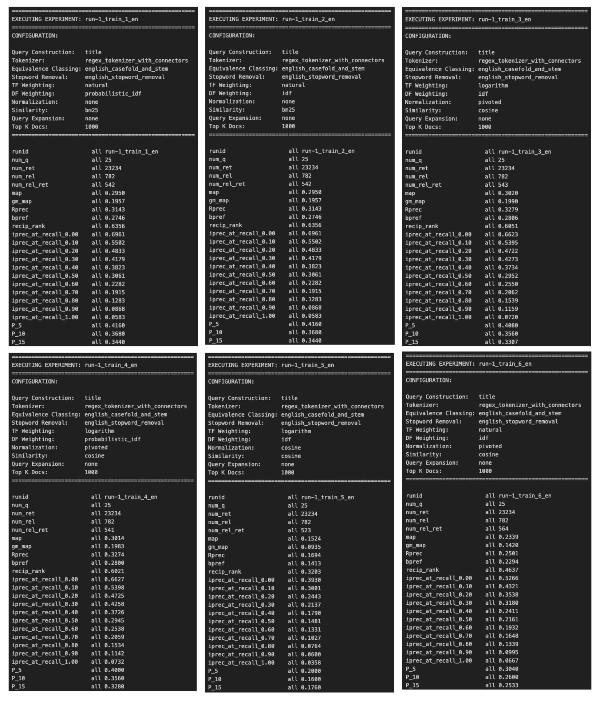
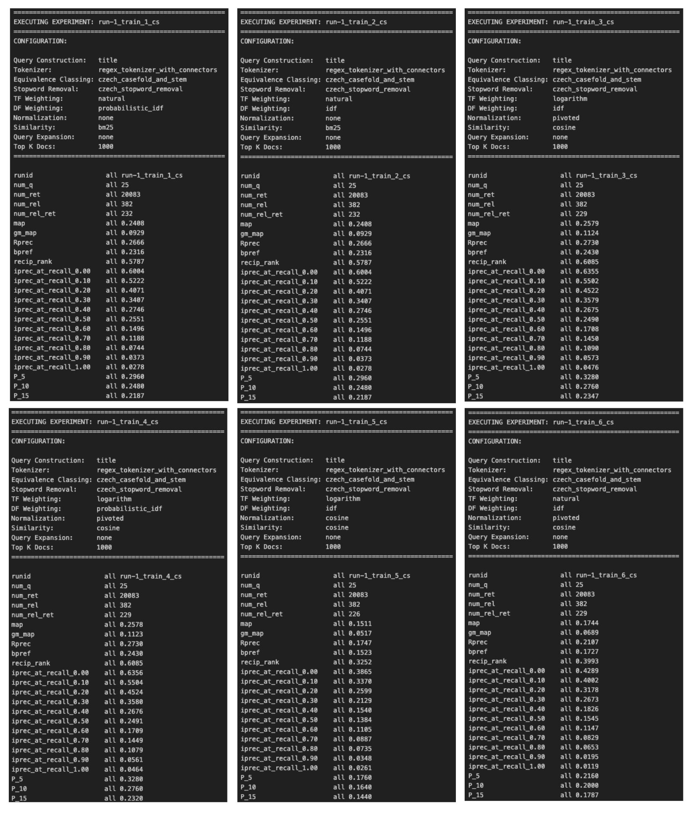
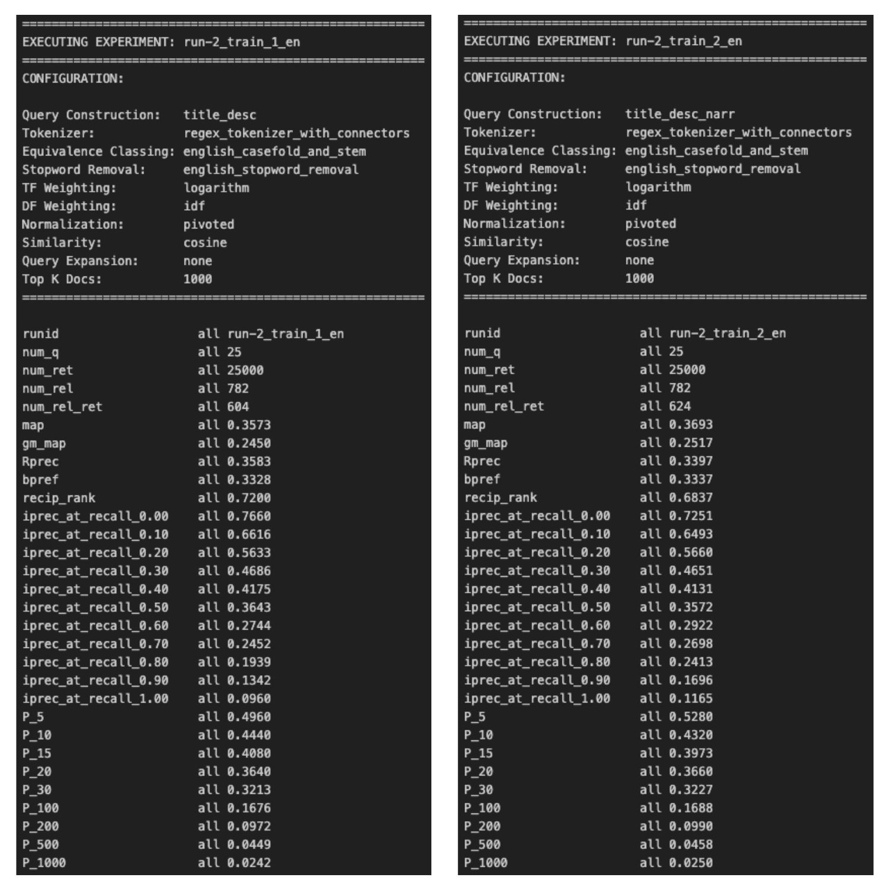
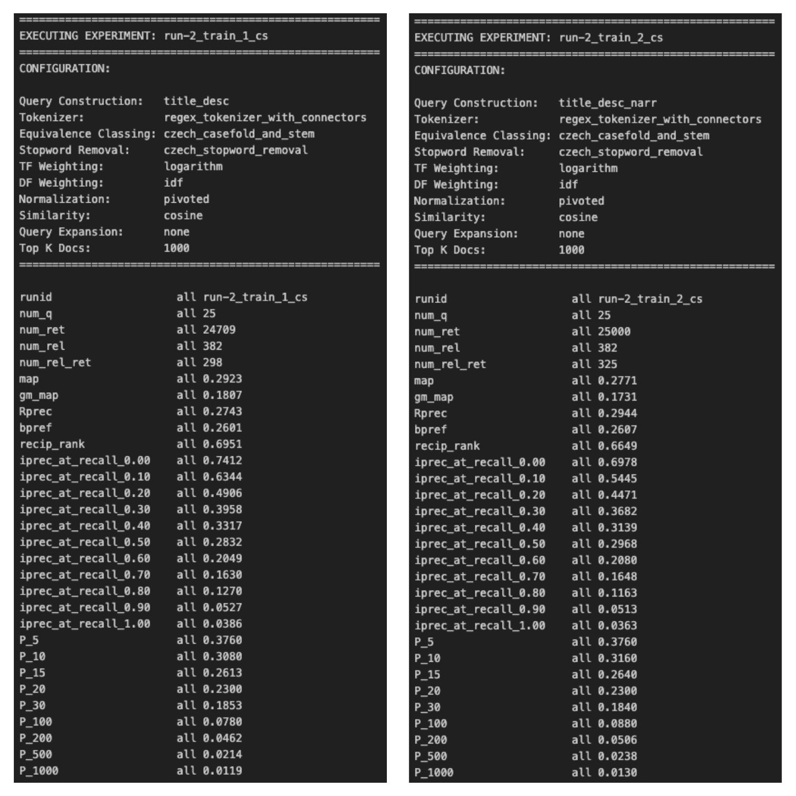

# Information Retrieval System
Author: Jakub Hajko 

## 1. Introduction
This project implements an experimental vector space model retrieval system for English and Czech documents. Developed as part of the NPFL103 Information Retrieval course, the system includes a robust, modular pipeline capable of text preprocessing, inverted index construction, configurable scoring (including TF-IDF and BM25), and performance evaluation against provided test collections.

## 2. Reproducibility

### Setup
Clone the repository and install the project in editable mode:
`git clone <url>`
`cd <project_dir>`
`pip install -e .`

### Data Dependencies
To execute the runs, the `data/` directory must be placed in the project root and contain the following structure:
* `documents_cs/` (directory)
* `documents_en/` (directory)
* `documents_cs.lst`
* `documents_en.lst`
* `topics-test_cs.xml`
* `topics-test_en.xml`
* `topics-train_cs.xml`
* `topics-train_en.xml`

### Running the Code
The pipeline is executed via the `run.py` entry point. Here is a standard example of how to execute a specific configuration (e.g., the English baseline):

python run.py -q data/topics-train_en.xml -d data/documents_en.lst -r run-0_train_en -o results/run-0_train_en.res

## 3. Architecture
The project follows a clean, modular pipeline designed for fast experimentation and low memory overhead. Rather than materializing dense vectors, the system builds an efficient inverted index and scores queries on the fly.

* **Entry point (`run.py`):** Orchestrates the execution of experiments. It parses CLI arguments, selects the appropriate `ExperimentConfig`, triggers data loading, builds the index, runs the retrieval engine, and writes the output.
* **Core package (`src/vector_space_model/`):**
  * `config.py`: Centralizes environment variables and path configurations for the corpus.
  * `index.py`: Constructs a lightweight, in-memory inverted index. It tracks term frequencies, postings lists, document lengths, and collection metadata required for advanced scoring models.
  * `load_documents.py`: Handles thread-safe XML parsing of the corpus. It extracts specific fields (like `TITLE`, `HEADING`, and `TEXT` for Czech, or `HD`, `LD`, and `TE` for English) and applies the text preprocessing pipeline to build the document token streams.
  * `load_topics.py`: Parses TREC-style XML topic files. It extracts `<num>`, `<title>`, `<desc>`, and `<narr>` fields, merging them into unified search queries based on the chosen experiment configuration.
  * `results.py`: Handles serialization of ranked outputs, ensuring the final files strictly adhere to the standard TREC tab-separated format required by the `trec_eval` tool.
  * `retrieval.py`: The core search engine. It performs highly optimized, on-the-fly scoring over the inverted index using cached document norms, ranking documents via score accumulation (e.g., Cosine or BM25).
  * `scoring.py`: Contains the mathematical formulations for Information Retrieval scoring. It includes term frequency (TF) weighting, inverse document frequency (IDF) variants, document length normalization (Pivoted, Cosine), and advanced BM25 parameters.
  * `text_preprocessing.py`: A highly composable pipeline offering regex-based tokenization, equivalence classing (case-folding, number normalization, Snowball/Porter stemming), and language-specific stopword removal.

## 4. Configurations
The modular architecture supports a wide domain of experiment configurations:

**Text Preprocessing Options:**
* **Tokenizer:** `regex_word_tokenizer`, `regex_tokenizer_with_connectors`
* **Equivalence Classing:** `None`, `english_casefold_and_stem`, `czech_casefold_and_stem`, `casefold_and_normalize_numbers`, `casefold_tokens`, `normalize_numbers`
* **Stopword Removal:** `None`, `english_stopword_removal`, `czech_stopword_removal`

**Retrieval & Scoring Options:**
* **Query Construction:** `title`, `title_desc`, `title_desc_narr`
* **TF Weighting:** `natural`, `logarithm`
* **DF Weighting:** `none`, `idf`, `probabilistic_idf`
* **Normalization:** `none`, `cosine`, `pivoted`
* **Similarity:** `cosine`, `bm25`
* **Query Expansion:** `none`, `thesaurus_based`

## 5. Experiments

### Baseline Results (Run 0)

This represents the unoptimized, natural-weighting baseline over raw, unstemmed tokens requested by the assignment.

### Improved Results (Run 1)
#### English Documents Best Config Analysis

**Key Insights & Takeaways:**

Top Performing Configuration (Run 3 & 4): The most effective setup utilized Cosine similarity combined with Logarithmic TF weighting and Pivoted normalization. Run 3 (using standard IDF) achieved the highest Mean Average Precision (MAP: 0.3020) and R-precision (0.3279) across all experiments.

The Importance of Normalization for Cosine: Cosine similarity proved to be highly sensitive to normalization. While Pivoted normalization yielded the best results (Runs 3 and 4), switching to standard Cosine normalization (Run 5) caused a drastic performance collapse, dropping MAP to a pipeline-low of 0.1524.

TF Weighting Impact: When using Cosine similarity and Pivoted normalization, Logarithmic TF (Run 3, MAP: 0.3020) vastly outperformed Natural TF (Run 6, MAP: 0.2339).

BM25 Stability (Run 1 & 2): The BM25 similarity metric showed solid, consistent baseline performance (MAP: 0.2950) that was entirely unaffected by the choice between standard IDF and Probabilistic IDF. Notably, while the overall MAP was slightly lower than the optimal Cosine setup, BM25 achieved the highest early precision (P@10: 0.3680), making it highly effective for top-ranked retrieval tasks.

#### Czech Documents Best Config Analysis

**Key Insights & Takeaways:**

Top Performing Configuration (Run 3 & 4): As seen in the English runs, the most effective setup utilized Cosine similarity combined with Logarithmic TF weighting and Pivoted normalization. Run 3 (using standard IDF) achieved the highest Mean Average Precision (MAP: 0.2579) and highest early precision (P@10: 0.2760). Probabilistic IDF (Run 4) performed almost identically.

The Importance of Normalization for Cosine: The sensitivity of Cosine similarity to normalization is pronounced in the Czech dataset as well. Switching from Pivoted normalization (Run 3) to standard Cosine normalization (Run 5) resulted in a massive performance drop, lowering MAP from 0.2579 to a pipeline-low of 0.1511.

TF Weighting Impact: Logarithmic TF is crucial for the Cosine/Pivoted setup. Using Natural TF instead (Run 6) caused a severe degradation in retrieval quality, dropping MAP to 0.1744.

BM25 Stability (Run 1 & 2): The BM25 metric once again proved to be a highly stable baseline (MAP: 0.2408). Similar to the English corpus, BM25 was completely indifferent to the choice between standard IDF and Probabilistic IDF, returning identical results across both runs. While it fell slightly short of the optimal Cosine setup across all metrics, it significantly outperformed the poorly configured Cosine runs (Runs 5 and 6).

### Even More Improved Results (Run 2)
Building upon the optimal baseline discovered in Run 1 (Logarithmic TF, IDF, Pivoted Normalization, and Cosine Similarity), this second phase of experiments focused entirely on Query Construction strategies.

By expanding the query formulation beyond the standard "Title" field to include "Description" (title_desc) and "Narrative" (title_desc_narr) fields, the pipeline achieved significant performance leaps.
#### English Documents

**Key Insights & Takeaways**

Massive Gains from Query Enrichment: Expanding the query scope proved highly effective. Compared to the best Run 1 baseline (which only used the Title field and achieved a MAP of 0.3020), adding the description field (Run 2.1) boosted the MAP to 0.3573. Adding the narrative field as well (Run 2.2) pushed the MAP to an impressive pipeline-high of 0.3693.

The Precision vs. Recall Trade-off: While the comprehensive title_desc_narr formulation (Run 2.2) achieved the highest overall MAP and retrieved the highest total number of relevant documents (624), it caused a slight dilution in early precision. The title_desc formulation (Run 2.1) actually performed better for top-ranked results, achieving higher R-precision (0.3583 vs. 0.3397) and P@10 (0.4440 vs. 0.4320).

#### Czech Documents

**Key Insights & Takeaways**

Consistent Gains from Query Enrichment: Just as seen in the English runs, expanding the query scope yielded significant improvements over the baseline. Compared to the best Run 1 Czech baseline (which relied only on the Title field and achieved a MAP of 0.2579), adding the description field (Run 2.1) boosted the MAP considerably to 0.2923, while also increasing the total number of relevant documents retrieved from 229 to 298.

Divergence from English Results: A fascinating contrast emerges when comparing the Czech results to the English results. For the English corpus, the comprehensive title_desc_narr formulation won out in overall MAP. However, for the Czech corpus, the title_desc_narr formulation (Run 2.2) experienced a drop in MAP (to 0.2771) compared to title_desc. This suggests that the narrative fields in the Czech dataset may introduce more noise or drift than their English counterparts.

## 6. AI Declaration
AI was utilized for writing code, but the architecture, pipeline design, and experimental planning were entirely engineered and described by the author.