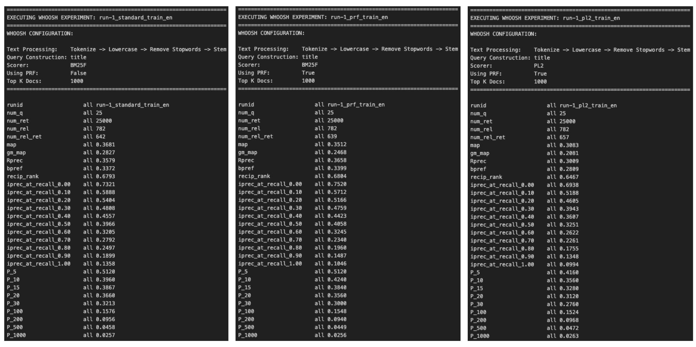
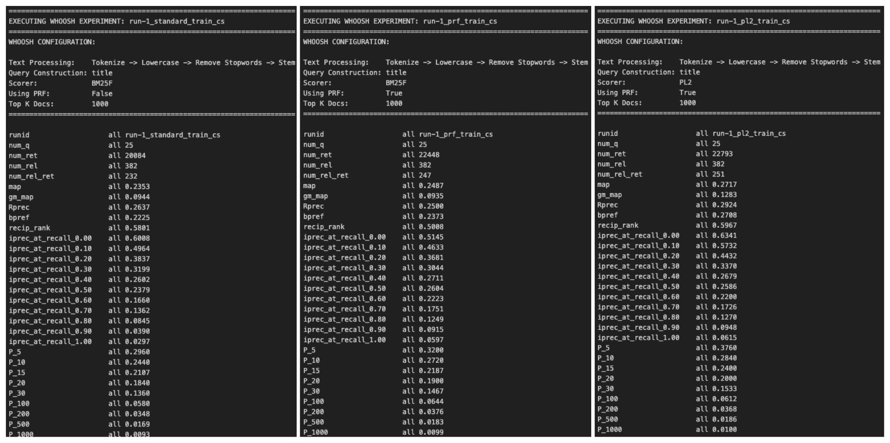
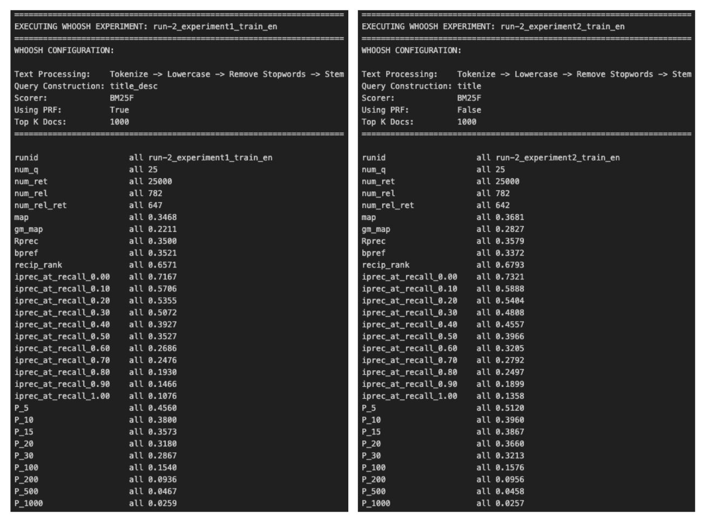
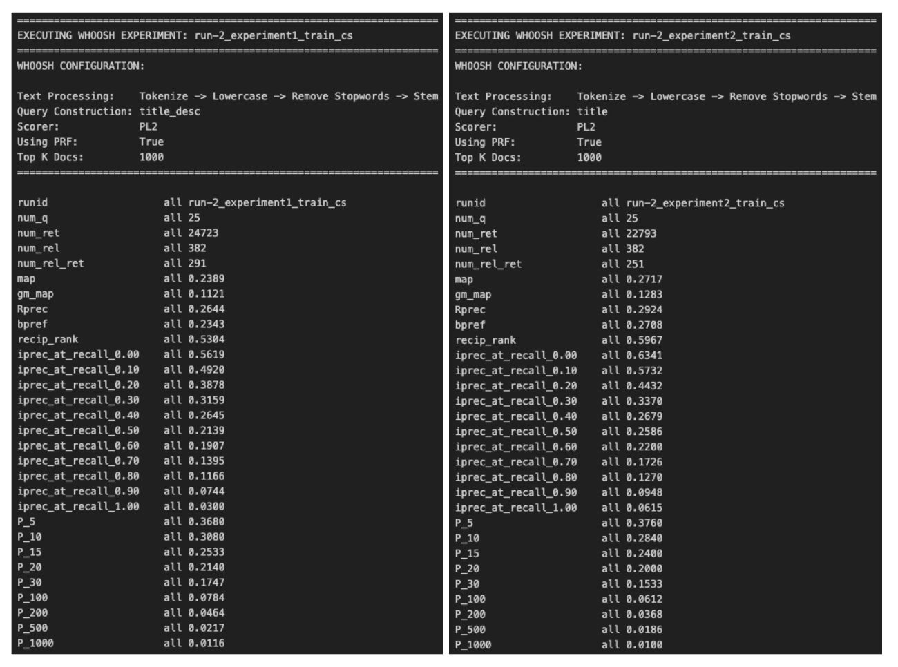

# Information Retrieval System
Author: Jakub Hajko 

## 1. Introduction
This project implements an experimental vector space model retrieval system for English and Czech documents. Developed as part of the NPFL103 Information Retrieval course, the project is divided into two distinct parts:
* **Assignment 1:** Focuses on building a robust, custom pipeline from scratch capable of text preprocessing, inverted index construction, configurable scoring (including TF-IDF and BM25), and performance evaluation against provided test collections.
* **Assignment 2:** Extends the project by integrating the **Whoosh** search engine library, replacing the custom index math with a highly optimized, persistent, disk-based engine while utilizing the data loading and XML parsing infrastructure built in Assignment 1.

## 2. Reproducibility

### Setup
Clone the repository and install the project in editable mode:
`git clone <url>`
`cd <project_dir>`
`pip install -e .`

For Assignment 2, the `whoosh` library is required:
`uv add whoosh` (or `pip install whoosh`)

### Data Dependencies
To execute the runs, the `data/` directory must be placed in the project root and contain the following structure:
* `documents_cs/` (directory)
* `documents_en/` (directory)
* `documents_cs.lst`
* `documents_en.lst`
* `topics-test_cs.xml`
* `topics-test_en.xml`
* `topics-train_cs.xml`
* `topics-train_en.xml`

### Running the Code
The pipeline is executed via the `run_assignment1.py` and `run_assignment2.py` entry points. Here are standard examples of how to execute a specific configuration:

**Assignment 1 (Custom Engine):**
`python run_assignment1.py -q data/topics-train_en.xml -d data/documents_en.lst -r run-0_train_en -o results/run-0_train_en.res`

**Assignment 2 (Whoosh Engine):**
`python run_assignment2.py -q data/topics-train_en.xml -d data/documents_en.lst -r run-1_standard -o results/assignment2_run1_en.res`

## 3. Architecture
The project follows a clean, modular pipeline designed for fast experimentation and low memory overhead.

* **Entry points (`run_assignment1.py` & `run_assignment2.py`):** Orchestrate the execution of experiments. They parse CLI arguments, select the appropriate configurations, trigger data loading, build the index, run the retrieval engine, and write the output.
* **Core package (`src/vector_space_model/`):**
  * `config.py`: Centralizes environment variables and path configurations for the corpus.
  * `whoosh_engine.py`: **(Assignment 2)** The bridge between the custom data loaders and the Whoosh library. Handles persistent disk indexing, querying via Whoosh Analyzers, and advanced features like Pseudo-Relevance Feedback (PRF).
  * `index.py`: **(Assignment 1)** Constructs a lightweight, in-memory inverted index.
  * `load_documents.py`: Handles thread-safe XML parsing of the corpus. Extracts specific fields (`TITLE`, `HEADING`, `TEXT`, etc.).
  * `load_topics.py`: Parses TREC-style XML topic files. Extracts `<num>`, `<title>`, `<desc>`, and `<narr>` fields.
  * `results.py`: Handles serialization of ranked outputs, ensuring final files adhere to the standard TREC tab-separated format required by `trec_eval`.
  * `retrieval.py` & `scoring.py`: **(Assignment 1)** Core custom search engine and mathematical formulations (TF-IDF, Pivoted Normalization, BM25).
  * `text_preprocessing.py`: Composable pipeline for regex tokenization, equivalence classing (Snowball/Porter stemming), and stopword removal.

## 4. Configurations

### Assignment 1 Configurations (Custom Engine)
The modular architecture supports a wide domain of experiment configurations:
* **Tokenizer:** `regex_word_tokenizer`, `regex_tokenizer_with_connectors`
* **Equivalence Classing:** `None`, `english_casefold_and_stem`, `czech_casefold_and_stem`, `casefold_and_normalize_numbers`, `casefold_tokens`, `normalize_numbers`
* **Stopword Removal:** `None`, `english_stopword_removal`, `czech_stopword_removal`
* **Query Construction:** `title`, `title_desc`, `title_desc_narr`
* **TF Weighting:** `natural`, `logarithm`
* **DF Weighting:** `none`, `idf`, `probabilistic_idf`
* **Normalization:** `none`, `cosine`, `pivoted`
* **Similarity:** `cosine`, `bm25`

### Assignment 2 Configurations (Whoosh Engine)
Whoosh is a fast, pure-Python search engine. Instead of manually applying text preprocessing and math, Whoosh bundles these into **Analyzers** and **Weighting Models**. 

* **Text Processing (Analyzers):** Whoosh's `StemmingAnalyzer` automatically tokenizes, lowercases, removes stopwords, and stems English text. For Czech, a custom filter chain utilizing the stemmer and stopword list from Assignment 1 was implemented.
* **Scoring (Weighting Models):** Explored modern probabilistic models including `BM25F` (tuning `B` and `K1`) and `PL2` (Divergence from Randomness).
* **Pseudo-Relevance Feedback (PRF):** Utilized Whoosh's `key_terms` method to extract statistically significant terms from top retrieved documents and automatically expand the query.

**Note on Run 0 Baseline:** The strict archaic constraints for Run 0 (Natural TF, No IDF, pure Cosine normalization) are fundamentally incompatible with modern search engines like Whoosh out of the box. Due to these limitations, the baseline Run 0 results presented in Assignment 2 simply reuse the exact baseline output generated by the custom Assignment 1 engine.

## 5. Experiments

### 5.1 Assignment 1 Experiments

#### Baseline Results (Run 0)

This represents the unoptimized, natural-weighting baseline over raw, unstemmed tokens requested by the assignment.

#### Improved Results (Run 1)
##### English Documents Best Config Analysis

**Key Insights & Takeaways:**
* Top Performing Configuration (Run 3 & 4): The most effective setup utilized Cosine similarity combined with Logarithmic TF weighting and Pivoted normalization. Run 3 (using standard IDF) achieved the highest Mean Average Precision (MAP: 0.3020) and R-precision (0.3279) across all experiments.
* The Importance of Normalization for Cosine: Cosine similarity proved to be highly sensitive to normalization. While Pivoted normalization yielded the best results (Runs 3 and 4), switching to standard Cosine normalization (Run 5) caused a drastic performance collapse, dropping MAP to a pipeline-low of 0.1524.
* TF Weighting Impact: When using Cosine similarity and Pivoted normalization, Logarithmic TF (Run 3, MAP: 0.3020) vastly outperformed Natural TF (Run 6, MAP: 0.2339).
* BM25 Stability (Run 1 & 2): The BM25 similarity metric showed solid, consistent baseline performance (MAP: 0.2950) that was entirely unaffected by the choice between standard IDF and Probabilistic IDF. Notably, while the overall MAP was slightly lower than the optimal Cosine setup, BM25 achieved the highest early precision (P@10: 0.3680), making it highly effective for top-ranked retrieval tasks.

##### Czech Documents Best Config Analysis

**Key Insights & Takeaways:**
* Top Performing Configuration (Run 3 & 4): As seen in the English runs, the most effective setup utilized Cosine similarity combined with Logarithmic TF weighting and Pivoted normalization. Run 3 (using standard IDF) achieved the highest Mean Average Precision (MAP: 0.2579) and highest early precision (P@10: 0.2760). Probabilistic IDF (Run 4) performed almost identically.
* The Importance of Normalization for Cosine: The sensitivity of Cosine similarity to normalization is pronounced in the Czech dataset as well. Switching from Pivoted normalization (Run 3) to standard Cosine normalization (Run 5) resulted in a massive performance drop, lowering MAP from 0.2579 to a pipeline-low of 0.1511.
* TF Weighting Impact: Logarithmic TF is crucial for the Cosine/Pivoted setup. Using Natural TF instead (Run 6) caused a severe degradation in retrieval quality, dropping MAP to 0.1744.
* BM25 Stability (Run 1 & 2): The BM25 metric once again proved to be a highly stable baseline (MAP: 0.2408). Similar to the English corpus, BM25 was completely indifferent to the choice between standard IDF and Probabilistic IDF, returning identical results across both runs. While it fell slightly short of the optimal Cosine setup across all metrics, it significantly outperformed the poorly configured Cosine runs (Runs 5 and 6).

#### Even More Improved Results (Run 2)
Building upon the optimal baseline discovered in Run 1 (Logarithmic TF, IDF, Pivoted Normalization, and Cosine Similarity), this second phase of experiments focused entirely on Query Construction strategies. By expanding the query formulation beyond the standard "Title" field to include "Description" (title_desc) and "Narrative" (title_desc_narr) fields, the pipeline achieved significant performance leaps.

##### English Documents

**Key Insights & Takeaways**
* Massive Gains from Query Enrichment: Expanding the query scope proved highly effective. Compared to the best Run 1 baseline (which only used the Title field and achieved a MAP of 0.3020), adding the description field (Run 2.1) boosted the MAP to 0.3573. Adding the narrative field as well (Run 2.2) pushed the MAP to an impressive pipeline-high of 0.3693.
* The Precision vs. Recall Trade-off: While the comprehensive title_desc_narr formulation (Run 2.2) achieved the highest overall MAP and retrieved the highest total number of relevant documents (624), it caused a slight dilution in early precision. The title_desc formulation (Run 2.1) actually performed better for top-ranked results, achieving higher R-precision (0.3583 vs. 0.3397) and P@10 (0.4440 vs. 0.4320).

##### Czech Documents

**Key Insights & Takeaways**
* Consistent Gains from Query Enrichment: Just as seen in the English runs, expanding the query scope yielded significant improvements over the baseline. Compared to the best Run 1 Czech baseline (which relied only on the Title field and achieved a MAP of 0.2579), adding the description field (Run 2.1) boosted the MAP considerably to 0.2923, while also increasing the total number of relevant documents retrieved from 229 to 298.
* Divergence from English Results: A fascinating contrast emerges when comparing the Czech results to the English results. For the English corpus, the comprehensive title_desc_narr formulation won out in overall MAP. However, for the Czech corpus, the title_desc_narr formulation (Run 2.2) experienced a drop in MAP (to 0.2771) compared to title_desc. This suggests that the narrative fields in the Czech dataset may introduce more noise or drift than their English counterparts.

---

### 5.2 Assignment 2 Experiments (Whoosh Engine)

#### Baseline Results (Run 0)

*Note: Due to the strict mathematical constraints of the Run 0 specification (Natural Term Frequency, No Inverse Document Frequency, and raw Cosine Vector Normalization), it is incompatible with modern probabilistic engines like Whoosh. Thus, the baseline utilized for Assignment 2 comparisons remains the exact output generated by the custom engine in Assignment 1.*

#### Improved Results (Run 1)
##### English Documents 

**Key Insights & Takeaways:**
- The Modern Standard Wins Overall: The standard BM25F configuration (run-1_standard) achieved the highest Mean Average Precision (MAP: 0.3681), proving highly effective for short title queries and massively outperforming the best Assignment 1 custom baseline.

- PRF Boosts Early Precision: Adding Pseudo-Relevance Feedback to BM25F (run-1_prf) caused a slight drop in overall MAP (0.3512) but significantly improved early precision (P@10 jumped from 0.3960 to 0.4240), successfully pushing highly relevant documents to the very top.

- PL2 Excels at Recall, Not Precision: The Divergence from Randomness model (run-1_pl2) posted the lowest MAP (0.3083) but retrieved the highest total number of relevant documents (657), indicating it casts a wider net but struggles to rank hits as effectively as BM25F.

##### Czech Documents 

**Key Insights & Takeaways:**
- PL2 Dominates the Czech Corpus: In a sharp contrast to the English results, the Divergence from Randomness model (run-1_pl2) was the undisputed champion, achieving the highest MAP (0.2717), highest early precision (P@10: 0.2840), and retrieving the most relevant documents (251).

- PRF is Strictly Beneficial: Unlike the precision/recall trade-off seen in English, adding Pseudo-Relevance Feedback to BM25F (run-1_prf) strictly improved performance across the board. It boosted both overall MAP (from 0.2353 to 0.2487) and early precision (P@10 from 0.2440 to 0.2720).

- Standard BM25F Struggles Alone: The baseline BM25F setup without expansion (run-1_standard), which easily won the English evaluation, performed the worst here. This strongly indicates that the highly morphological Czech dataset desperately requires query expansion to overcome vocabulary mismatches in short title queries.

#### Even More Improved Results (Run 2)
##### English Documents

**Key Insights & Takeaways**
- Query Enrichment Backfires: Expanding the query to include the description alongside PRF (run-2_experiment1) actually degraded overall performance compared to the title-only baseline (run-2_experiment2), dropping MAP from 0.3681 to 0.3468.

- Dilution of Early Precision: The addition of verbose description fields combined with PRF expansion terms introduced semantic noise that harmed top-ranked results, causing P@10 to fall from 0.3960 to 0.3800.

- The Power of an Optimized Baseline: In stark contrast to Assignment 1 where adding descriptions drove massive gains, Whoosh’s highly optimized BM25F and stemming pipeline extracts such high value from short, focused title queries that verbose enrichment becomes counterproductive.

##### Czech Documents

**Key Insights & Takeaways**
- Query Enrichment Hurts Overall Ranking: Expanding the query to include descriptions (run-2_experiment1) degraded overall performance compared to the title-only setup (run-2_experiment2), dropping MAP from 0.2717 to 0.2389.

- A Strange Trade-off (Recall vs. MAP): Despite the drop in overall MAP, the verbose title_desc formulation successfully retrieved significantly more relevant documents overall (291 vs. 251) and actually improved early precision (P@10 rose from 0.2840 to 0.3080).

- The Power of Focused Queries: Similar to the English corpus, Whoosh’s optimized probabilistic engine (PL2 + PRF) extracts such high value from short, focused title queries that adding verbose descriptions introduces semantic noise that harms the overall ranking curve.

## 6. AI Declaration
AI was utilized for writing code, but the architecture, pipeline design, and experimental planning were entirely engineered and described by the author.